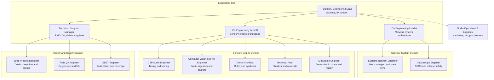

# Org Chart

## How To Use

- Use this to route ownership, escalation, and review.
- If work crosses cells, the cell leads and PM should align before execution.
- Keep the chart stable unless the company structure itself changes.

## Final Division Map

## Design Principle

- Teams own divisions, not just tasks.
- Leadership owns strategy and escalation.
- The PM owns horizontal risk, Git discipline, and delivery hygiene.

## Decision Owner

- Founder / Engineering Lead
